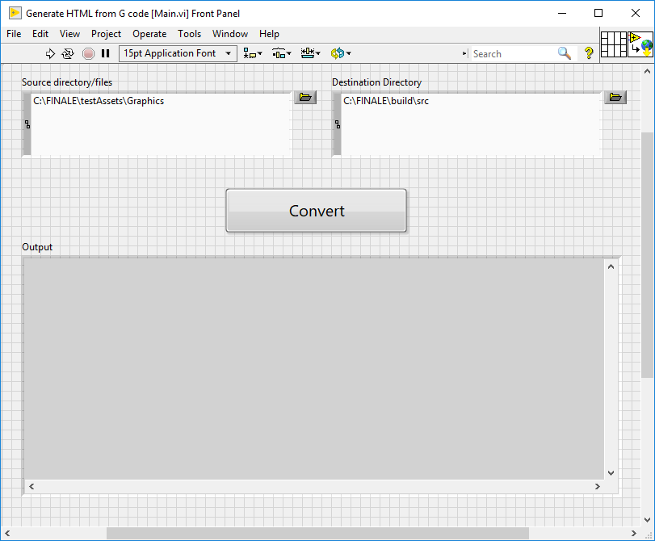

# FINALE

FINALE is a lightweight WebApp to view [LabVIEW](https://www.ni.com/en-in/shop/labview.html) code. FINALE stands for FINALE Is Not A LabVIEW Editor.

This solves many use cases like:
  - Code sharing: Sharing LabVIEW code with a person who does not have LabVIEW installed.
  - Viewing LabVIEW code without launching LabVIEW.
  - Viewing LabVIEW code saved in incompatible version.
  - Viewing LabVIEW code that is being used with TestStand.

# Contents

- Features
- Setting up FINALE for your code

# Features

  - A left pane to display project hierarchy.
  - Search functionality to find things of interest quickly.
  - Support for viewing the following file types:
    - VI
    - CTL
    - LVClass
    - LLB
    - LVProj
    - Polymorphic VI
  - Support for viewing Multi Frame Structures like:
    - Case Structures
    - Event Structures
    - Diagram Disable Structures
    - Stacked Sequence Structures
  - Navigation to SubVIs and Dynamic Dispatch SubVIs.

Note: FINALE is not supported by National Instruments and this is mostly internal tooling that we are exposing. This is a work in progress, and is not yet feature complete.

# Setting up FINALE for your code

FINALE has two parts, the HTML Generator and the WebApp. The HTML Generator converts LabVIEW code to a FINALE format(A composition of JSON documents,images,etc. which is understood by the WebApp). These are input to the WebApp which opens a web-based viewer for the files converted. 
## Prerequisites: 
- LabVIEW: Required only for converting the files.
- Browser: Google Chrome/Firefox (Does not have complete support in Edge)
- Python 3+ (For CLI tool)
- [npm](https://www.npmjs.com/get-npm)
- [npm http-server](https://www.npmjs.com/package/http-server)
>Note: If there are errors with the npm http-server, try installing at this version:
>
>`npm install –g http-server@0.9.0`

The WebApp is developed using NPM. Run the following commands to produce binaries under a "build" directory.
```sh
git clone https://github.com/ni/finale && cd finale
npm install
npm run build-webapp
```

## Running FINALE:
Follow these instructions to run FINALE:
- Once you have the repository built and set up according to the above commands, proceed to the next step.

- ### Converting LabVIEW code to FINALE format: 
   - Navigate to "buid/HTMLGenerator/".

   - Open Main.vi and enter values for the following:
     - Source directory/files: Path to the source LabVIEW code file(s) or folder.
     - Destination Directory: Path to the destination directory. To view the files using the WebApp, make sure your destination is set to "<Path/to/FINALE/repo>/build/src".
     - Run Main.vi and click "Convert".
   
     > Note: If you require certain files/projects to be preloaded for converting  the files, open GeneratorUI-Advanced.vi and enter values for the following:
     >  - Top level output path: <Path/to/FINALE/repo>/build/src
     >  - Files to Preload: Array of files you want to preload. If this is  left empty it is equivalent to running Main.vi.
     >  - File(s)/Folder to convert: Path to the source LabVIEW code file(s) or  folders.
     >  - Destination Folder (relative to output path): This is an optional  field to specify an output path for the converted files. This must  be relative to the Top level output path.

- ### Converting LabVIEW code to FINALE format using the CLI:
  - On cmd or powershell, navigate to <Path/of/FINALE/repo>/build/HTMLGenerator.
  - Run command:
  > `python -c "import converter; converter.convert_from_JSON('<Absolute/Path/For/JSON/file>')"`
  - The JSON file mentioned above should be of the structure:
    ```json
      {
      "topPath": <"Absolute path where you want the converted JSON to be stored">,
      "inputPath": <"Absolute Path to the source files/directory that needs to be converted">
      }
    ```

  > Note: May need to install PathLib module (https://pypi.org/project/pathlib/)


- ### Launching the WebApp:
   - On cmd or powershell, navigate to the "build" directory in the repo and start the npm http-server:
   >`http-server` 
   - The above command will list the converted files in the project hierarchy on the left pane.
   - FINALE should now be ready to use!

# Contributing to the project

Contributions to FINALE are welcome from all!

For more details, see [Contributing.md](./Contributing.md)
